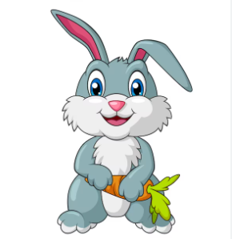
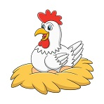
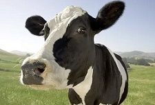
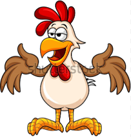

# Práctica Tema 3

#### **Ejercicios con Arrays, y de paso con algo de Math**
   1. Crea un array de 10 elementos, pero sin inicializar. Llamalo *Números*.
   2. Inicializa esos elementos con números aleatorios (usa métodos de la clase `Math`), entre 0 y mil. Redondea los número a dos decimales.
   4. Imprime por pantalla todos los elementos del array (con un `toString()` se puede hacer, pero quiero que recorrais el array con una estructura de control).
   5. Imprime por pantalla el número mayor  y el menor (Podéis hacerlo usando las funciones de la clase `Math`, o bien con un algoritmo de burbuja sencillito. Buscad el algoritmo de la burbuja, que es bonito).
   6. Imprimir también qué **posición** ocupan estos números dentro del arrray.
   7. Elimina del array esos elementos, el mayor y el menor, y muestra de nuevo el array.
   8. Crea un nuevo array, que contenga, la raíz cuadrada (del primero), cúbica (del segundo), cuarta (del tercero) etc de los elementos del array *Numeros*. Este array se llamará *Raíces*.
   9. Añade en *Raíces* un primer elemento, cuyo valor será 1. Imprime el array entero por consola.
   10. Añade al array *Números* aquellos elementos de *Raíces* que sean mayores que uno.
   11. Finalmente, ordena *Numeros* e imprimelo por consola. Tambien puedes hacer un `document.write()`.

#### Objetos
   1. Tenemos que hacer la página web de una **Granja**, que tiene los siguientes animales:

       1.  **Ovejas**, que: 
            1. Pueden ser de diferentes *razas* (merinas, churras etc).
            2. Tienen un *color*, que cuando nacen es blanco (valor por defecto), aunque conforme crecen a algunas de ellas les puede cambiar.
            3. Son capaces de proporcionar un *máximo* de X litros de leche, este dato es propio de cada ejemplar de oveja, y depende de su genética. 
            4. Pueden o no estar *esquiladas*.
            5. Las ovejas se pueden *ordeñar*, y nos van a devolver una cantidad Y de litros de leche ( que estará entre 0 y el máximo). Si una oveja se queda *embarazada* automaticamente no puede producir leche (0 litros).
            6. Las ovejas *balan*, es decir, imprimen por pantalla el mensaje "Beeeee"
            7. Cuando se **muestran** las ovejas, nos interesa saber: su *raza*, *color*, y cuanta *leche en total* han producido (por tanto este dato, además de devolverse, deberá almacenarse internamente).

       2. **Conejos**, son seres de luz que: 
            1. Pueden ser de varios *colores*, (un conejo puede tener varios colores a la vez, ej blanco, marrón, negro).
            2. Pueden tener las *orejas* pa arriba, o pa abajo. Este y el anterior son dos datos propios de cada conejo cuando nace.
            3. Pueden *dar cariño* (de 0 a 100). Este dato, aunque se puede cambiar a lo largo de la vida del conejo, inicialmente es un número aleatorio.
            4. Son capaces de *roer con una potencia* de 1 a 100. Inicialmente también es un numero aleatorio que puede cambiar con el tiempo.
            5. Para saber el *índice de achuchabilidad* del conejo deberemos dividir el cariño entre la potencia de roedura
            6.  También debemos saber si un conejo *es o no achuchable*, si tiene un índice de achuchabilidad mayor de 0,5.
            7.  Los conejos se *achuchan*; si es achuchable mostrará pon pantalla cariñitos; si no es achuchable dirá "buffffff".
            8.  Cuando se **muestran** los conejos, nos interesa saber: los *colores*, pa dónde van las *orejas*, y si es achuchable se acompañará del mensaje "quiero ser tu mejor amigooo". Si no es achuchable, sólo mostrará los dos primeros datos.
   
       3. **Gallinas**, seres magníficos que: 
            1.  Nos proporcionan huevos de diferentes *colores*. Cada gallina sólo es capaz de poner huevos de un color, que debemos guardar. 
            2.  Nos interesa saber la *cantidad total de huevos* que nos ha proporcionado la gallina, por defecto 0, pero cada vez que ponen un huevo, se aumentara. 
            3.  También habrá un *índice de ponibilidad* que es el número de huevos que ha puesto la gallina entre los dias que tiene de adulta (pasados los primeros 6 meses).
            4.  Se debe *controlar* si pasado el primer año, el índice de ponibilidad de una gallina cae por debajo de 0,1, o si se pasa una semana sin poner un huevo. En este caso, hay que avisar a los de Gallina Blanca.
            5.  Las gallinas *cacarean*, imprimiendo por pantalla un mensaje "caaaaa caaaca ca caaaaaa". Normalmenteo cacarean justo al terminar de poner un huevo.
            6.  Cuando se **muestran** las gallinas, nos interesa saber el *color de sus huevos*, cuantos *huevos totales* lleva puestos, y *cuantos en la última semana*. Si el índice de ponibilidad es menor de 0,1, se añadirá el mensaje "Poooo po po po, me voy al puchero".
      1. **Vacas**, son seres muuuuy inteligentes que: 
            1. Pueden tener varios *colores*, igual que los conejos.
            2. Tienen cuernos, de los que debemos guardar su *longitud*.
            3. Son capaces de proporcionar un máximo de X litros de leche, este dato es propio de cada ejemplar de vaca. 
            4. La leche de vaca puede ser *entera*, *desnatada*, *semidesnatada* o *merengada*.
            5. Las vacas se pueden *ordeñar*, y nos van a devolver una cantidad Y de litros de leche ( que estará entre 0 y el máximo). Si una vaca se queda *embarazada* automaticamente no puede producir leche (0 litros).
            6. Las vacas *mugen*, imprimiendo por pantalla el mensaje *"muuuuuuu-cho cuidado que tengo cuernos"*. **A veces**, cuando se las *ordeña*, *mugen*.
            7. Cuando **mostramos** las vacas, nos interesa saber sus colores, la cantidad de leche que llevan dada. Si la vaca está embarazada, debe añadirse el mensaje "estoy esperando un ternerito".
         2. **Gallos**, esos seres graciosos del corral: 
            1. Deberemos almacenar su *raza*.
            2. Tendrá alguno o varios de estos *colores* (azul, verde, amarillo, marrón, blanco, negro, gris). Esto es un hecho aleatorio y depende de su genética. ¿sabiendo que los posibles colores del gallo son esos 7, podéis almacenarlos de una forma eficiente?.
            3. Pueden *cantar*, de tal forma que entre las 4 y las 8 am, o si han pasado 5 minutos desde la última vez que cantó, muestra por pantalla "kikirikiiiiii". Si no han pasado esos cinco minutos, muestar "poo popopo pooo".
            4. Cuando se **muestran** los gallos, nos interesa saber sus colores, y la hora del último canto que ha hecho.
         
   2. **Se pide**:
      1. Crear las **funciones constructoras** de cada uno de los animales anteriores. Tened en cuenta que al crear un animal deberemos pasarle valores para los atributos que no tengan un valor por defecto. Todos los objetos tienen atributos (algunos con setter y getter), métodos (algunos con logica), y todos tienen una función `toString()` que debéis definir según se indica.
   
      2. Crear un objeto de cada tipo, y manipuladlo un poco. Según esto:
         1. La oveja será churra, y estará esquilada. La ordeñaremos dos veces, después quedará embarazada e intentaremos ordeñarla otra vez. Cuando cambiemos el color de la oveja a marrón, balará. 
         2. El conejo será de colores azul, rojo y verde (sí tenemos un conejo RGB), con las orejas para abajo. Lo achucharemos, si es no achuchable cambiaremos los valores de cariño para que sea achuchable, y lo volveremos a achuchar.
         3. La gallina tiene 7 meses y pondrá los huevos de color *azul fosforito*. Controlaremos la ponibilidad de la gallina (que debe ser 0 porque acabamos de crearla). Despues pondrá tres huevos, y lo comprobaremos de nuevo.
         4. La vaca será de color negro, con unos cuernos de 0,1 metros. Esta vaca da leche desnatada. La ordeñaremos varias veces (hasta que muja al menos una vez) y mostraremos cuanta leche nos ha dado.
         5. El gallo, será de raza *azarqueliana*, cantará varias veces seguidas.
         6. Después de todo esto, mostraremos los cinco animales, llamando a su `toString()`.
   
  
   3. La granja está compuesta por cuatro cuadras (una por cada tipo de animales), y un gallo. Cada cuadra tiene un número aleatorio de animales entre 5 y 10. Crea la granja utilizando el constructor *Object* o directamente con la notación literal (pero no hagas un constructor).
   4. Inicializa los animales de las cuadras usando valores aleatorios (en el caso de los colores, podeis utilizar un switch). Imprimelos todos usando estructuras de control. Incluye el gallo que has creado antes.
   5. Selecciona, mediante funciones de **lambda**, sobre cada array (cuadra).
         1. la oveja que más leche es capaz de dar (máximo de leche).
         2. el conejo con mayor índice de achuchabilidad.
         3. la gallina con más edad.
         4. la vaca con los cuernos más largos.
   6. Guarda estos animales en un array de *AnimalesSelectos*. Imprimelo a través de las funciones `toString()` de los objetos.
   7.  Serializa en JSON los *AnimalesSelectos*, e imprimelo también.
   